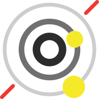

# An Erp by 依赖注入

> A handsome, efficent, incredible erp system.

[GitHub](https://github.com/dependency-inject/an-erp)
[Get Started](/README ':target=_self')

<!-- background image -->
 0%,hsl(40, 100%, 85%) 100%))