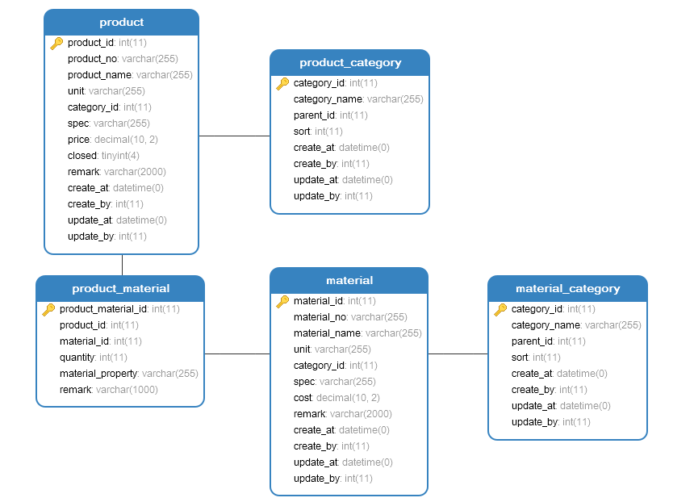
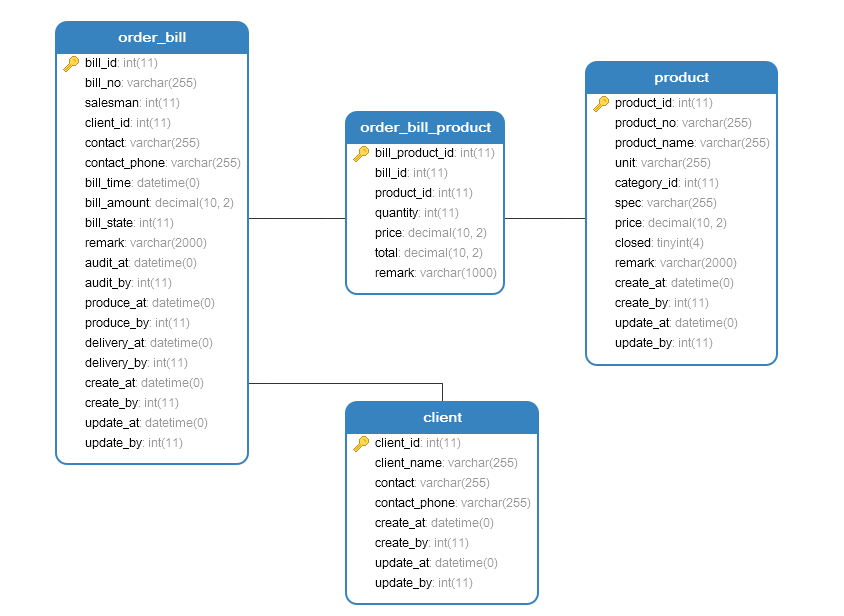
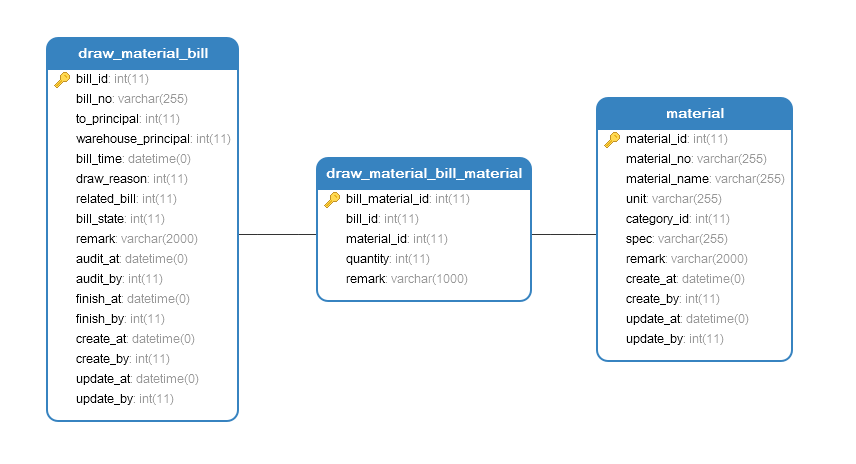
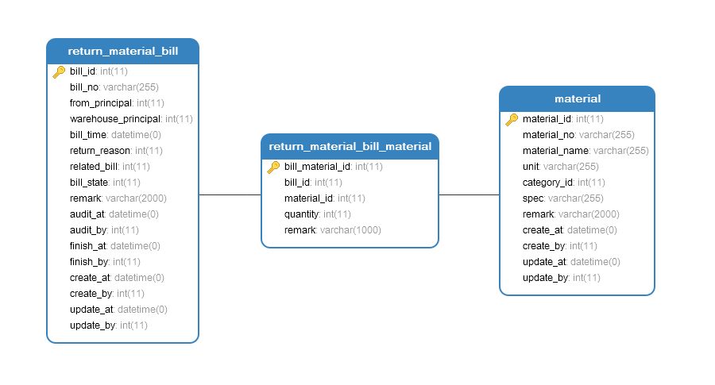
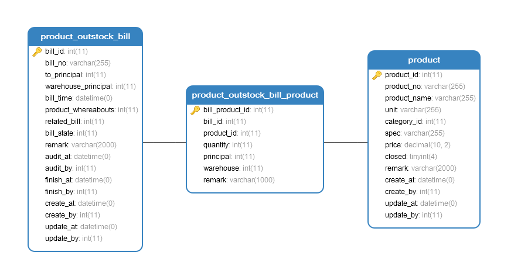
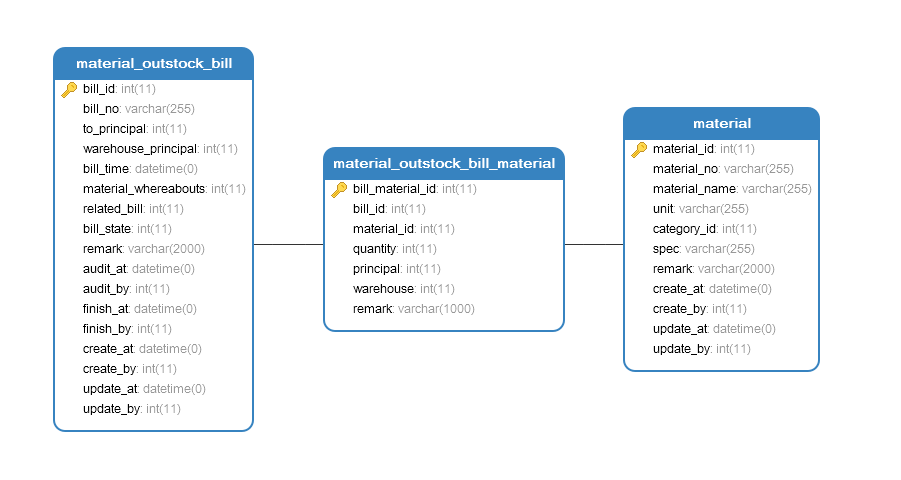
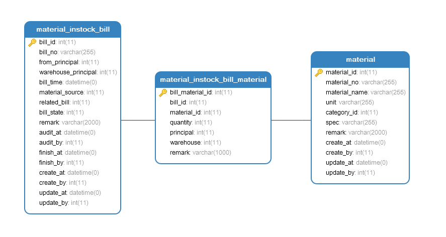
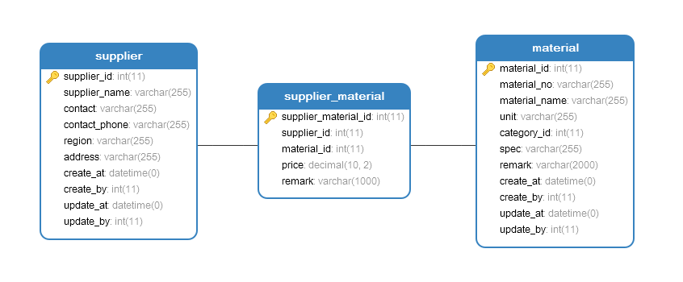
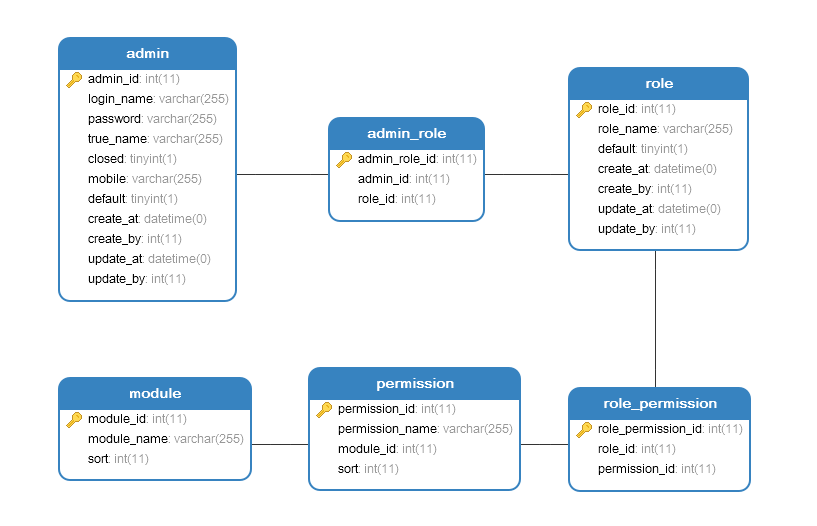

## 数据建模

数据建模结果，以 ER 图以及“数据库字典”形式呈现。

### BOM信息

#### 货品表（product）

| 字段名          | 数据类型          | 允许为空 | PK             | 字段说明          |
| ------------ | ------------- | ---- | -------------- | ------------- |
| product_id   | int(11)       | NO   | auto_increment | 货品ID          |
| product_no   | varchar(255)  | YES  |                | 货品编号          |
| product_name | varchar(255)  | YES  |                | 货品名称          |
| unit         | varchar(255)  | YES  |                | 计量单位          |
| category_id  | int(11)       | YES  |                | 类别ID          |
| spec         | varchar(255)  | YES  |                | 规格            |
| price        | decimal(10,2) | YES  |                | 价格            |
| closed       | tinyint(4)    | YES  |                | 是否停用（0启用，1停用） |
| remark       | varchar(2000) | YES  |                | 备注            |
| create_at    | datetime      | YES  |                | 创建时间          |
| create_by    | int(11)       | YES  |                | 创建者           |
| update_at    | datetime      | YES  |                | 更新时间          |
| update_by    | int(11)       | YES  |                | 更新者           |

#### 货品类别表（product_category）

| 字段名           | 数据类型         | 允许为空 | PK             | 字段说明         |
| ------------- | ------------ | ---- | -------------- | ------------ |
| category_id   | int(11)      | NO   | auto_increment | 货品类别ID       |
| category_name | varchar(255) | YES  |                | 类别名称         |
| parent_id     | int(11)      | YES  |                | 父类ID（呈现树形类别） |
| sort          | int(11)      | YES  |                | 排序值          |
| create_at     | datetime     | YES  |                | 创建时间         |
| create_by     | int(11)      | YES  |                | 创建者          |
| update_at     | datetime     | YES  |                | 更新时间         |
| update_by     | int(11)      | YES  |                | 更新者          |

#### 货品物料关联表（prodcut_material）

| 字段名                 | 数据类型          | 允许为空 | PK             | 字段说明 |
| ------------------- | ------------- | ---- | -------------- | ---- |
| product_material_id | int(11)       | NO   | auto_increment |      |
| product_id          | int(11)       | YES  |                | 货品ID |
| material_id         | int(11)       | YES  |                | 物料ID |
| quantity            | int(11)       | YES  |                | 数量   |
| material_property   | varchar(255)  | YES  |                | 配料属性 |
| remark              | varchar(1000) | YES  |                | 备注   |

#### 物料表（material）

| 字段名           | 数据类型          | 允许为空 | PK             | 字段说明 |
| ------------- | ------------- | ---- | -------------- | ---- |
| material_id   | int(11)       | NO   | auto_increment | 物料ID |
| material_no   | varchar(255)  | YES  |                | 物料编号 |
| material_name | varchar(255)  | YES  |                | 物料名称 |
| unit          | varchar(255)  | YES  |                | 计量单位 |
| category_id   | int(11)       | YES  |                | 类别ID |
| spec          | varchar(255)  | YES  |                | 规格   |
| cost          | decimal(10,2) | YES  |                | 成本   |
| remark        | varchar(2000) | YES  |                | 备注   |
| create_at     | datetime      | YES  |                | 创建时间 |
| create_by     | int(11)       | YES  |                | 创建者  |
| update_at     | datetime      | YES  |                | 更新时间 |
| update_by     | int(11)       | YES  |                | 更新者  |

#### 物料类别表（material_category）

| 字段名           | 数据类型         | 允许为空 | PK             | 字段说明         |
| ------------- | ------------ | ---- | -------------- | ------------ |
| category_id   | int(11)      | NO   | auto_increment | 物料类别ID       |
| category_name | varchar(255) | YES  |                | 类别名称         |
| parent_id     | int(11)      | YES  |                | 父类ID（呈现树形类别） |
| sort          | int(11)      | YES  |                | 排序值          |
| create_at     | datetime     | YES  |                | 创建时间         |
| create_by     | int(11)      | YES  |                | 创建者          |
| update_at     | datetime     | YES  |                | 更新时间         |
| update_by     | int(11)      | YES  |                | 更新者          |

### 订单相关

#### 订单表（order_bill）

| 字段名           | 数据类型          | 允许为空 | PK             | 字段说明                           |
| ------------- | ------------- | ---- | -------------- | ------------------------------ |
| bill_id       | int(11)       | NO   | auto_increment | 订单ID                           |
| bill_no       | varchar(255)  | YES  |                | 订单编号                           |
| salesman      | int(11)       | YES  |                | 销售人员（制单人员ID）                   |
| client_id     | int(11)       | YES  |                | 客户ID                           |
| contact       | varchar(255)  | YES  |                | 联系人                            |
| contact_phone | varchar(255)  | YES  |                | 联系电话                           |
| bill_time     | datetime      | YES  |                | 下单时间                           |
| bill_amount   | decimal(10,2) | YES  |                | 订单金额                           |
| bill_state    | int(11)       | YES  |                | 订单状态（1待审核，2已审核，3生产中，4已发货，5已取消） |
| remark        | varchar(2000) | YES  |                | 备注                             |
| audit_at      | datetime      | YES  |                | 审核时间                           |
| audit_by      | int(11)       | YES  |                | 审核者                            |
| produce_at    | datetime      | YES  |                | 启动生产时间                         |
| produce_by    | int(11)       | YES  |                | 生产负责人                          |
| delivery_at   | datetime      | YES  |                | 发货时间                           |
| delivery_by   | int(11)       | YES  |                | 发货者                            |
| create_at     | datetime      | YES  |                | 创建时间                           |
| create_by     | int(11)       | YES  |                | 创建者                            |
| update_at     | datetime      | YES  |                | 更新时间                           |
| update_by     | int(11)       | YES  |                | 更新者                            |

#### 订单货品关联表（order_bill_product）

| 字段名             | 数据类型          | 允许为空 | PK             | 字段说明 |
| --------------- | ------------- | ---- | -------------- | ---- |
| bill_product_id | int(11)       | NO   | auto_increment |      |
| bill_id         | int(11)       | YES  |                | 订单ID |
| product_id      | int(11)       | YES  |                | 货品ID |
| quantity        | int(11)       | YES  |                | 数量   |
| price           | decimal(10,2) | YES  |                | 单价   |
| total           | decimal(10,2) | YES  |                | 小计   |
| remark          | varchar(1000) | YES  |                | 备注   |

#### 客户表（client）

| 字段名           | 数据类型         | 允许为空 | PK             | 字段说明 |
| ------------- | ------------ | ---- | -------------- | ---- |
| client_id     | int(11)      | NO   | auto_increment | 客户ID |
| client_name   | varchar(255) | YES  |                | 客户姓名 |
| contact       | varchar(255) | YES  |                | 联系人  |
| contact_phone | varchar(255) | YES  |                | 联系电话 |
| create_at     | datetime     | YES  |                | 创建时间 |
| create_by     | int(11)      | YES  |                | 创建者  |
| update_at     | datetime     | YES  |                | 更新时间 |
| update_by     | int(11)      | YES  |                | 更新者  |

### 领料单相关

#### 领料单表（draw_material_bill）

| 字段名                 | 数据类型          | 允许为空 | PK             | 字段说明                  |
| ------------------- | ------------- | ---- | -------------- | --------------------- |
| bill_id             | int(11)       | NO   | auto_increment | 领料单ID                 |
| bill_no             | varchar(255)  | YES  |                | 领料单编号                 |
| to_principal        | int(11)       | YES  |                | 领料人                   |
| warehouse_principal | int(11)       | YES  |                | 仓库负责人                 |
| bill_time           | datetime      | YES  |                | 领料单创建时间               |
| draw_reason         | int(11)       | YES  |                | 领料原因（1生产领料，2研发领料）     |
| related_bill        | int(11)       | YES  |                | 相关订单ID（研发领料时为空）       |
| bill_state          | int(11)       | YES  |                | 领料单状态（1待审核，2已审核，3已完成） |
| remark              | varchar(2000) | YES  |                | 备注                    |
| audit_at            | datetime      | YES  |                | 审核时间                  |
| audit_by            | int(11)       | YES  |                | 审核者                   |
| finish_at           | datetime      | YES  |                | 完成时间                  |
| finish_by           | int(11)       | YES  |                | 完成者                   |
| create_at           | datetime      | YES  |                | 创建时间                  |
| create_by           | int(11)       | YES  |                | 创建者                   |
| update_at           | datetime      | YES  |                | 更新时间                  |
| update_by           | int(11)       | YES  |                | 更新者                   |

#### 领料单物料关联表（draw_material_bill_material）

| 字段名              | 数据类型          | 允许为空 | PK             | 字段说明  |
| ---------------- | ------------- | ---- | -------------- | ----- |
| bill_material_id | int(11)       | NO   | auto_increment |       |
| bill_id          | int(11)       | YES  |                | 领料单ID |
| material_id      | int(11)       | YES  |                | 物料ID  |
| quantity         | int(11)       | YES  |                | 数量    |
| remark           | varchar(1000) | YES  |                | 备注    |

### 退料单相关

#### 退料单表（return_material_bill）

| 字段名                 | 数据类型          | 允许为空 | PK             | 字段说明                  |
| ------------------- | ------------- | ---- | -------------- | --------------------- |
| bill_id             | int(11)       | NO   | auto_increment | 退料单ID                 |
| bill_no             | varchar(255)  | YES  |                | 退料单编号                 |
| from_principal      | int(11)       | YES  |                | 退料人                   |
| warehouse_principal | int(11)       | YES  |                | 仓库负责人                 |
| bill_time           | datetime      | YES  |                | 退料单创建时间               |
| return_reason       | int(11)       | YES  |                | 退料原因（1生产退料，研发退料）      |
| related_bill        | int(11)       | YES  |                | 相关订单ID（研发退料时为空）       |
| bill_state          | int(11)       | YES  |                | 退料单状态（1待审核，2已审核，3已完成） |
| remark              | varchar(2000) | YES  |                | 备注                    |
| audit_at            | datetime      | YES  |                | 审核时间                  |
| audit_by            | int(11)       | YES  |                | 审核者                   |
| finish_at           | datetime      | YES  |                | 完成时间                  |
| finish_by           | int(11)       | YES  |                | 完成者                   |
| create_at           | datetime      | YES  |                | 创建时间                  |
| create_by           | int(11)       | YES  |                | 创建者                   |
| update_at           | datetime      | YES  |                | 更新时间                  |
| update_by           | int(11)       | YES  |                | 更新者                   |

#### 退料单物料关联表（return_material_bill_material）

| 字段名              | 数据类型          | 允许为空 | PK             | 字段说明  |
| ---------------- | ------------- | ---- | -------------- | ----- |
| bill_material_id | int(11)       | NO   | auto_increment |       |
| bill_id          | int(11)       | YES  |                | 退料单ID |
| material_id      | int(11)       | YES  |                | 物料ID  |
| quantity         | int(11)       | YES  |                | 数量    |
| remark           | varchar(1000) | YES  |                | 备注    |

### 货品出库相关

#### 货品出库单表（product_outstock_bill）

| 字段名                 | 数据类型          | 允许为空 | PK             | 字段说明                    |
| ------------------- | ------------- | ---- | -------------- | ----------------------- |
| bill_id             | int(11)       | NO   | auto_increment | 货品出库单ID                 |
| bill_no             | varchar(255)  | YES  |                | 货品出库单编号                 |
| to_principal        | int(11)       | YES  |                | 领货人                     |
| warehouse_principal | int(11)       | YES  |                | 仓库负责人                   |
| bill_time           | datetime      | YES  |                | 货品出库单创建时间               |
| product_whereabouts | int(11)       | YES  |                | 货品去向（1发货出库）             |
| related_bill        | int(11)       | YES  |                | 相关订单ID                  |
| bill_state          | int(11)       | YES  |                | 货品出库单状态（1待审核，2已审核，3已完成） |
| remark              | varchar(2000) | YES  |                | 备注                      |
| audit_at            | datetime      | YES  |                | 审核时间                    |
| audit_by            | int(11)       | YES  |                | 审核者                     |
| finish_at           | datetime      | YES  |                | 完成时间                    |
| finish_by           | int(11)       | YES  |                | 完成者                     |
| create_at           | datetime      | YES  |                | 创建时间                    |
| create_by           | int(11)       | YES  |                | 创建者                     |
| update_at           | datetime      | YES  |                | 更新时间                    |
| update_by           | int(11)       | YES  |                | 更新者                     |

#### 货品出库单货品关联表（product_outstock_bill_product）

| 字段名             | 数据类型          | 允许为空 | PK             | 字段说明    |
| --------------- | ------------- | ---- | -------------- | ------- |
| bill_product_id | int(11)       | NO   | auto_increment |         |
| bill_id         | int(11)       | YES  |                | 货品出库单ID |
| product_id      | int(11)       | YES  |                | 货品ID    |
| quantity        | int(11)       | YES  |                | 数量      |
| principal       | int(11)       | YES  |                | 盘点负责人   |
| warehouse       | int(11)       | YES  |                | 仓库ID    |
| place           | varchar(255)  | YES  |                | 仓库内位置   |
| remark          | varchar(1000) | YES  |                | 备注      |

### 货品入库相关

#### 货品入库单表（product_instock_bill）

| 字段名                 | 数据类型          | 允许为空 | PK             | 字段说明                    |
| ------------------- | ------------- | ---- | -------------- | ----------------------- |
| bill_id             | int(11)       | NO   | auto_increment | 货品入库单ID                 |
| bill_no             | varchar(255)  | YES  |                | 货品入库单编号                 |
| from_principal      | int(11)       | YES  |                | 交货人                     |
| warehouse_principal | int(11)       | YES  |                | 仓库负责人                   |
| bill_time           | datetime      | YES  |                | 货品入库单创建时间               |
| product_source      | int(11)       | YES  |                | 货品来源（1生产入库）             |
| related_bill        | int(11)       | YES  |                | 预留字段                    |
| bill_state          | int(11)       | YES  |                | 货品入库单状态（1待审核，2已审核，3已完成） |
| remark              | varchar(2000) | YES  |                | 备注                      |
| audit_at            | datetime      | YES  |                | 审核时间                    |
| audit_by            | int(11)       | YES  |                | 审核者                     |
| finish_at           | datetime      | YES  |                | 完成时间                    |
| finish_by           | int(11)       | YES  |                | 完成者                     |
| create_at           | datetime      | YES  |                | 创建时间                    |
| create_by           | int(11)       | YES  |                | 创建者                     |
| update_at           | datetime      | YES  |                | 更新时间                    |
| update_by           | int(11)       | YES  |                | 更新者                     |

#### 货品入库单货品关联表（product_instock_bill_product）

| 字段名             | 数据类型          | 允许为空 | PK             | 字段说明    |
| --------------- | ------------- | ---- | -------------- | ------- |
| bill_product_id | int(11)       | NO   | auto_increment |         |
| bill_id         | int(11)       | YES  |                | 货品入库单ID |
| product_id      | int(11)       | YES  |                | 货品ID    |
| quantity        | int(11)       | YES  |                | 数量      |
| principal       | int(11)       | YES  |                | 盘点负责人   |
| warehouse       | int(11)       | YES  |                | 仓库ID    |
| place           | varchar(255)  | YES  |                | 仓库内位置   |
| remark          | varchar(1000) | YES  |                | 备注      |

### 物料出库相关

#### 物料出库单表（material_outstock_bill）

| 字段名                  | 数据类型          | 允许为空 | PK             | 字段说明                    |
| -------------------- | ------------- | ---- | -------------- | ----------------------- |
| bill_id              | int(11)       | NO   | auto_increment | 物料出库单ID                 |
| bill_no              | varchar(255)  | YES  |                | 物料出库单编号                 |
| to_principal         | int(11)       | YES  |                | 领料人                     |
| warehouse_principal  | int(11)       | YES  |                | 仓库负责人                   |
| bill_time            | datetime      | YES  |                | 物料出库单创建时间               |
| material_whereabouts | int(11)       | YES  |                | 物料去向（1领料出库）             |
| related_bill         | int(11)       | YES  |                | 相关领料单ID                 |
| bill_state           | int(11)       | YES  |                | 物料出库单状态（1待审核，2已审核，3已完成） |
| remark               | varchar(2000) | YES  |                | 备注                      |
| audit_at             | datetime      | YES  |                | 审核时间                    |
| audit_by             | int(11)       | YES  |                | 审核者                     |
| finish_at            | datetime      | YES  |                | 完成时间                    |
| finish_by            | int(11)       | YES  |                | 完成者                     |
| create_at            | datetime      | YES  |                | 创建时间                    |
| create_by            | int(11)       | YES  |                | 创建者                     |
| update_at            | datetime      | YES  |                | 更新时间                    |
| update_by            | int(11)       | YES  |                | 更新者                     |

#### 物料出库单物料关联表（material_outstock_bill_material）

| 字段名              | 数据类型          | 允许为空 | PK             | 字段说明    |
| ---------------- | ------------- | ---- | -------------- | ------- |
| bill_material_id | int(11)       | NO   | auto_increment |         |
| bill_id          | int(11)       | YES  |                | 物料出库单ID |
| material_id      | int(11)       | YES  |                | 物料ID    |
| quantity         | int(11)       | YES  |                | 数量      |
| principal        | int(11)       | YES  |                | 盘点负责人   |
| warehouse        | int(11)       | YES  |                | 仓库ID    |
| place            | varchar(255)  | YES  |                | 仓库内位置   |
| remark           | varchar(1000) | YES  |                | 备注      |

### 物料入库相关

#### 物料入库单表（material_instock_bill）

| 字段名                 | 数据类型          | 允许为空 | PK             | 字段说明                    |
| ------------------- | ------------- | ---- | -------------- | ----------------------- |
| bill_id             | int(11)       | NO   | auto_increment | 物料入库单ID                 |
| bill_no             | varchar(255)  | YES  |                | 物料入库单编号                 |
| from_principal      | int(11)       | YES  |                | 交料人                     |
| warehouse_principal | int(11)       | YES  |                | 仓库负责人                   |
| bill_time           | datetime      | YES  |                | 物料入库单创建时间               |
| material_source     | int(11)       | YES  |                | 物料来源（1退料入库，2采购入库）       |
| related_bill        | int(11)       | YES  |                | 相关退料单ID（采购入库时为空）        |
| bill_state          | int(11)       | YES  |                | 物料入库单状态（1待审核，2已审核，3已完成） |
| remark              | varchar(2000) | YES  |                | 备注                      |
| audit_at            | datetime      | YES  |                | 审核时间                    |
| audit_by            | int(11)       | YES  |                | 审核者                     |
| finish_at           | datetime      | YES  |                | 完成时间                    |
| finish_by           | int(11)       | YES  |                | 完成者                     |
| create_at           | datetime      | YES  |                | 创建时间                    |
| create_by           | int(11)       | YES  |                | 创建者                     |
| update_at           | datetime      | YES  |                | 更新时间                    |
| update_by           | int(11)       | YES  |                | 更新者                     |

#### 物料入库单物料关联表（material_instock_bill_material）

| 字段名              | 数据类型          | 允许为空 | PK             | 字段说明    |
| ---------------- | ------------- | ---- | -------------- | ------- |
| bill_material_id | int(11)       | NO   | auto_increment |         |
| bill_id          | int(11)       | YES  |                | 物料入库单ID |
| material_id      | int(11)       | YES  |                | 物料ID    |
| quantity         | int(11)       | YES  |                | 数量      |
| principal        | int(11)       | YES  |                | 盘点负责人   |
| warehouse        | int(11)       | YES  |                | 仓库ID    |
| place            | varchar(255)  | YES  |                | 仓库内位置   |
| remark           | varchar(1000) | YES  |                | 备注      |

### 采购相关

#### 供应商表（supplier）

| 字段名           | 数据类型         | 允许为空 | PK             | 字段说明  |
| ------------- | ------------ | ---- | -------------- | ----- |
| supplier_id   | int(11)      | NO   | auto_increment | 供应商ID |
| supplier_name | varchar(255) | YES  |                | 供应商名称 |
| contact       | varchar(255) | YES  |                | 联系人   |
| contact_phone | varchar(255) | YES  |                | 联系电话  |
| region        | varchar(255) | YES  |                | 地区    |
| address       | varchar(255) | YES  |                | 地址    |
| create_at     | datetime     | YES  |                | 创建时间  |
| create_by     | int(11)      | YES  |                | 创建者   |
| update_at     | datetime     | YES  |                | 更新时间  |
| update_by     | int(11)      | YES  |                | 更新者   |

#### 供应商物料报价表（supplier_material）

| 字段名                  | 数据类型          | 允许为空 | PK             | 字段说明  |
| -------------------- | ------------- | ---- | -------------- | ----- |
| supplier_material_id | int(11)       | NO   | auto_increment |       |
| supplier_id          | int(11)       | YES  |                | 供应商ID |
| material_id          | int(11)       | YES  |                | 物料ID  |
| price                | decimal(10,2) | YES  |                | 价格    |
| remark               | varchar(1000) | YES  |                | 备注    |

### 用户权限相关

#### 用户表（admin）

| 字段名         | 数据类型         | 允许为空 | PK             | 字段说明           |
| ----------- | ------------ | ---- | -------------- | -------------- |
| admin_id    | int(11)      | NO   | auto_increment | 用户ID           |
| login_name  | varchar(255) | YES  |                | 登录名（唯一）        |
| password    | varchar(255) | YES  |                | 密码（加密）         |
| true_name   | varchar(255) | YES  |                | 真实姓名           |
| closed      | tinyint(1)   | YES  |                | 是否停用（0启用，1停用）  |
| mobile      | varchar(255) | YES  |                | 手机             |
| sys_default | tinyint(1)   | YES  |                | 是否默认（默认用户不可删除） |
| create_at   | datetime     | YES  |                | 创建时间           |
| create_by   | int(11)      | YES  |                | 创建者            |
| update_at   | datetime     | YES  |                | 更新时间           |
| update_by   | int(11)      | YES  |                | 更新者            |

#### 用户角色关联表（admin_role）

| 字段名           | 数据类型    | 允许为空 | PK             | 字段说明 |
| ------------- | ------- | ---- | -------------- | ---- |
| admin_role_id | int(11) | NO   | auto_increment |      |
| admin_id      | int(11) | YES  |                | 用户ID |
| role_id       | int(11) | YES  |                | 角色ID |

#### 角色表（role）

| 字段名         | 数据类型         | 允许为空 | PK             | 字段说明           |
| ----------- | ------------ | ---- | -------------- | -------------- |
| role_id     | int(11)      | NO   | auto_increment | 角色ID           |
| role_name   | varchar(255) | YES  |                | 角色名称           |
| sys_default | tinyint(1)   | YES  |                | 是否默认（默认角色不可删除） |
| create_at   | datetime     | YES  |                | 创建时间           |
| create_by   | int(11)      | YES  |                | 创建者            |
| update_at   | datetime     | YES  |                | 更新时间           |
| update_by   | int(11)      | YES  |                | 更新者            |

#### 角色权限关联表（role_permission）

| 字段名                | 数据类型    | 允许为空 | PK             | 字段说明 |
| ------------------ | ------- | ---- | -------------- | ---- |
| role_permission_id | int(11) | NO   | auto_increment |      |
| role_id            | int(11) | YES  |                | 角色ID |
| permission_id      | int(11) | YES  |                | 权限ID |

#### 权限表（permission）

| 字段名             | 数据类型         | 允许为空 | PK             | 字段说明 |
| --------------- | ------------ | ---- | -------------- | ---- |
| permission_id   | int(11)      | NO   | auto_increment | 权限ID |
| permission_name | varchar(255) | YES  |                | 权限名称 |
| module_id       | int(11)      | YES  |                | 模块ID |
| sort            | int(11)      | YES  |                | 排序值  |

#### 模块表（module）

| 字段名         | 数据类型         | 允许为空 | PK             | 字段说明 |
| ----------- | ------------ | ---- | -------------- | ---- |
| module_id   | int(11)      | NO   | auto_increment | 模块ID |
| module_name | varchar(255) | YES  |                | 模块名称 |
| sort        | int(11)      | YES  |                | 排序值  |
