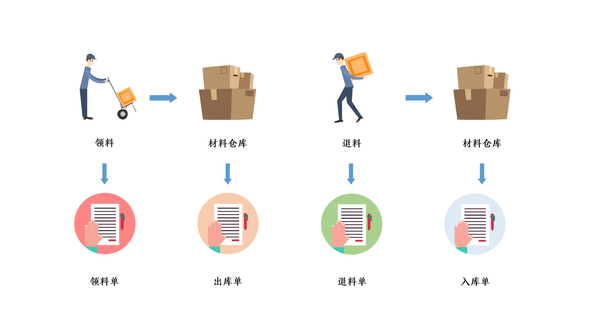
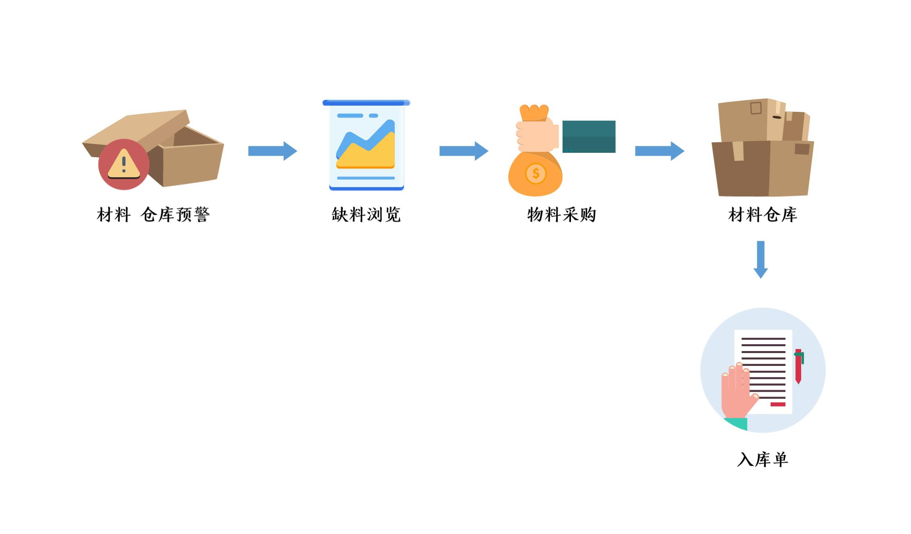

## 系统模块

本 ERP 系统的功能设计上，不涉及具体生产以及采购过程。

### 功能模块

* BOM 管理（货品资料、货品类别、物料资料、物料类别）
* 销售管理（订单、客户资料）
* 生产管理（生产领料、生产退料）
* 仓库管理（货品入库、货品出库、货品库存统计、物料入库、物料出库、物料库存统计、仓库）
* 成本管理（物料成本资料、库存成本统计）
* 采购辅助管理（供应商资料、缺料情况）
* 研发辅助管理（研发领料、研发退料）
* 用户管理（用户资料、角色与权限资料）
* ~~综合设置（系统设置、操作日志）~~

### 角色列表

| 编号        | 角色名称  | 描述                    | 功能模块      |
| --------- | ----- | --------------------- | --------- |
| **role1** | 业务管理员 | 负责维护客户以及订单信息          | 销售管理      |
| role2     | 资料管理员 | 负责维护货品、物料以及相应类别等BOM信息 | BOM管理     |
| **role3** | 生产管理员 | 负责通过订单信息制定生产计划以及领料退料  | 生产管理      |
| **role4** | 仓库管理员 | 负责维护仓库以及物料出入库信息       | 仓库管理      |
| role5     | 财务管理员 | 负责维护物料成本信息            | 成本管理      |
| **role6** | 物料采购员 | 负责维护物料供应商及物料报价信息      | 采购辅助管理    |
| **role7** | 研发工程师 | 负责新产品的研发              | 研发辅助管理    |
| role8     | 系统管理员 | 负责维护用户、权限以及系统设置信息     | 用户管理 |

### 业务流程

#### 订单、生产

相关角色：role1、role3

#### 领料、退料

相关角色：role3、role4、role7

#### 物料采购

相关角色：role6
