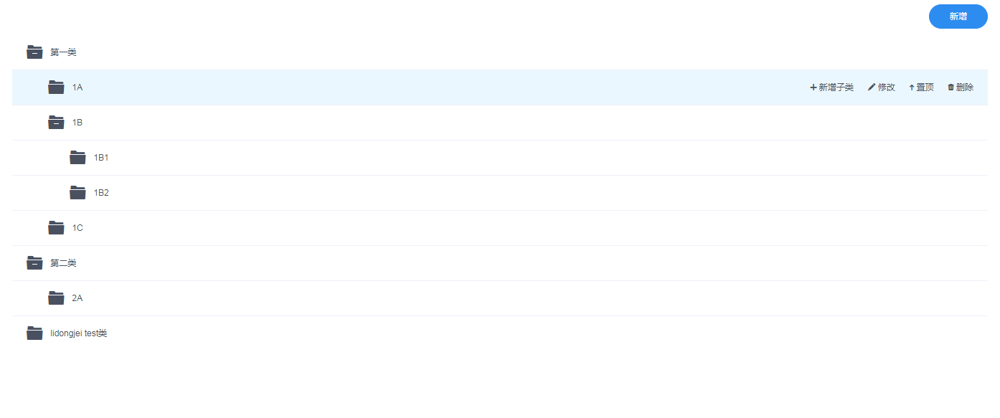

## 前端组件 —— treeTable



**用途：**货品类别、物料类别列表页中，以树形方式呈现信息

### 代码示例

```vue
<template>
    <div>
        <tree-table ref="table" :columns="columnList" :data="items" :operates="tableOperates" @remove="remove([arguments[0]])"></tree-table>
    </div>
</template>

<script>
import treeTable from '../../components/tree-table';

export default {
    data() {
        return {
            items: [
                { categoryName: '父分类1', parent: -1 },
                { categoryName: '子分类11', parent: 0 },
                { categoryName: '父分类2', parent: -1 },
                { categoryName: '子分类12', parent: 0 },
                { categoryName: '子分类21', parent: 2 },
            ],
            // 控制表格显示哪些列
            columnList: [
                { title: '类别名称', key: 'categoryName', width: 400 }
            ],
            // 控制表格有哪些操作
            tableOperates: [
                { event: "remove", icon: "trash-a", text: "删除", checkChild: true }
            ]
        }
    },
    components: { treeTable },
    methods: {
        remove(selectItems) {
            // 删除操作
        }
    }
}
</script>
```

其中，colmuns 属性定义了表格要显示哪些内容；operates 属性定义了表格会提供哪些操作的接口，这些操作被点击时都会触发一个相应的事件，事件名称由 event 定义。

### API

**组件 Props**

| 属性       | 说明                                     | 类型               | 默认值  |
| -------- | -------------------------------------- | ---------------- | ---- |
| data     | 显示的树形结构化数据，其中，字段 parent 定义父节点数据的 index | Array            | []   |
| columns  | 表格列的配置描述，具体项见后文                        | Array            | []   |
| operates | 表格操作的配置描述，具体项见后文                       | Array            | []   |
| width    | 表格宽度，单位 px                             | Number \| String | 自动   |
| height   | 表格高度，单位 px                             | Number \| String | -    |

**组件 events**

| 事件名称    | 说明                 | 返回值    |
| ------- | ------------------ | ------ |
| （用户自定义） | operates 属性对应触发的事件 | 当前行的数据 |

**column**

列描述数据对象，是 columns 中的一项。实际上只有第一个对象有效，即表格只显示第一列信息。

| 属性    | 说明          | 类型     | 默认值  |
| ----- | ----------- | ------ | ---- |
| title | 列头显示文字（不显示） | String | -    |
| key   | 对应列内容的字段名   | String | -    |
| width | 列宽          | Number | -    |

**operate**

操作描述数据对象，是 operates 中的一项。

| 属性         | 说明                               | 类型      | 默认值   |
| ---------- | -------------------------------- | ------- | ----- |
| event      | 操作被点击时，触发的事件名称                   | String  | -     |
| icon       | 操作对应的图标（具体图标类型参见 icon）           | String  | -     |
| text       | 操作对应的名称                          | String  | -     |
| checkChild | 检查是否有子节点，若为 true，则当有子节点时，点击事件不触发 | Boolean | false |