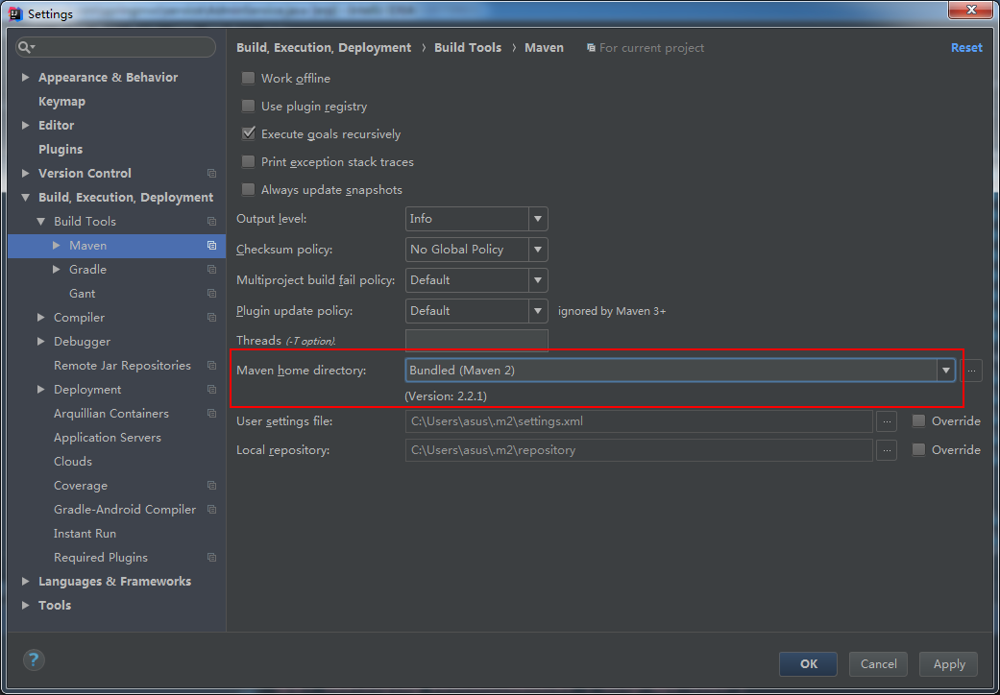

## 问题整理——搭建开发环境

如果搭建开发环境出现了问题，请先查看本文档中是否提及解决方案（解决方案中每条建议彼此独立）。

!> 建议下 windows 下运行本项目，Linux 下 npm install 可能会出现缺少依赖包的情况（比如 libpng16）。如果你想在 Linux 运行本项目，请自行解决依赖问题。

### sass 包下载失败

`npm install` 过程，需要从 `github` 下载 `sass` 依赖包，这个过程可能比较缓慢，甚至下载失败。

**解决方案：**

* 切换连接网络（使用 nku 而不是 teda）
* 如果你有 VPN 的话，可以尝试通过 VPN 全局代理解决问题

### 系统登录名及密码

默认登录系统的登录名和密码，参见 [快速开始](/README.md) 中的 **测试账号（全权限）**

### npm audit, Severity Critical

`npm install` 过程出现类似下面的情况

```shell
# npm install
npm WARN optional SKIPPING OPTIONAL DEPENDENCY: fsevents@1.1.3 (node_modules/fsevents):
npm WARN notsup SKIPPING OPTIONAL DEPENDENCY: Unsupported platform for fsevents@1.1.3: wanted {"os":"darwin","arch":"any"} (current: {"os":"linux","arch":"x64"})

up to date in 20.926s
[!] 103 vulnerabilities found [29692 packages audited]
    Severity: 31 Low | 65 Moderate | 6 High | 1 Critical
    Run `npm audit` for more detail

# npm audit
[...]
┌───────────────┬──────────────────────────────────────────────────────────────┐
│ Critical      │ Command Injection                                            │
├───────────────┼──────────────────────────────────────────────────────────────┤
│ Package       │ macaddress                                                   │
├───────────────┼──────────────────────────────────────────────────────────────┤
│ Patched in    │ No patch available                                           │
├───────────────┼──────────────────────────────────────────────────────────────┤
│ Dependency of │ laravel-mix [dev]                                            │
├───────────────┼──────────────────────────────────────────────────────────────┤
│ Path          │ laravel-mix > css-loader > cssnano > postcss-filter-plugins  │
│               │ > uniqid > macaddress                                        │
├───────────────┼──────────────────────────────────────────────────────────────┤
│ More info     │ https://nodesecurity.io/advisories/654                       │
└───────────────┴──────────────────────────────────────────────────────────────┘

[!] 103 vulnerabilities found - Packages audited: 29692 (29572 dev, 1349 optional)
    Severity: 31 Low | 65 Moderate | 6 High | 1 Critical
```

该问题是由于 `npm` 高版本（>=5.10）开始引入 `npm audit` 机制，会自动对依赖关系树进行安全审计。项目中引用的 `laravel-mix` 包存在一些依赖问题，但目前官网未该问题进行解决。

**临时解决方案：**

* 将本地的 `npm` 版本更换为 <=5.9

### IntelliJ IDEA 下 maven 包导入失败

IntelliJ IDEA 下如果 `maven` 包导入失败，pom.xml 文件会出现一堆**红线**。

**解决方案：**

* 打开 IntelliJ IDEA 右侧 Maven Projects 窗口，找到 Lifecycle > install，双击运行该过程。若该过程出现报错或未解决问题，请看下一条方案。

?> 若在 IntelliJ IDEA 中找不到 Maven Projects 窗口，请尝试点击左下角小框，maven 应该能从里面找到；或者点击菜单栏 View > Tool Windows > Maven projects。

* 切换 maven 版本。切换方式为：点击菜单栏 File > Setting 打开窗口，在该窗口下找到 Build,Execution,Deployment > Build Tools > Maven，将 Maven home directory 这一项由 Bundled(Maven 3) 切换为 Bundled(Maven 2)。最后点击“OK”关闭窗口，等待重新导入依赖包。


